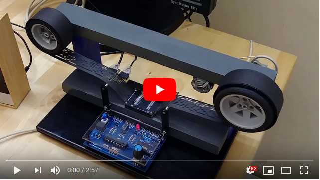
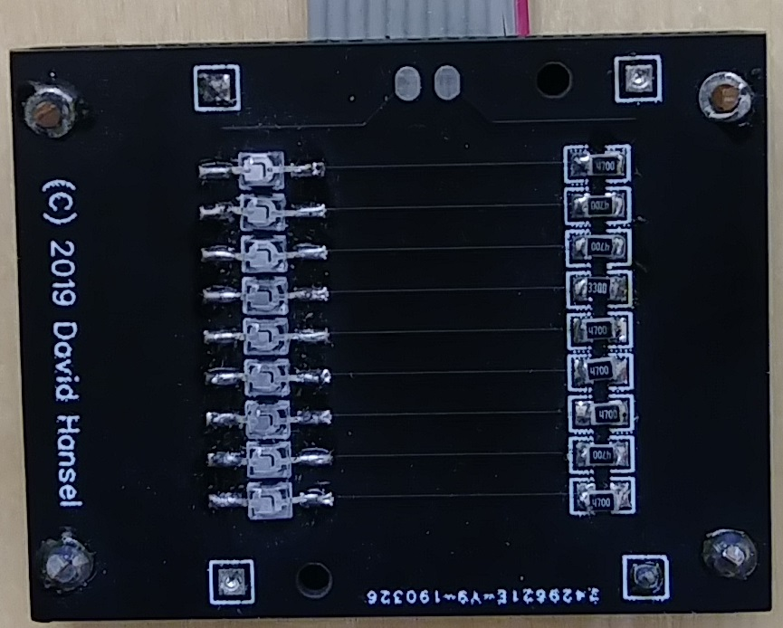
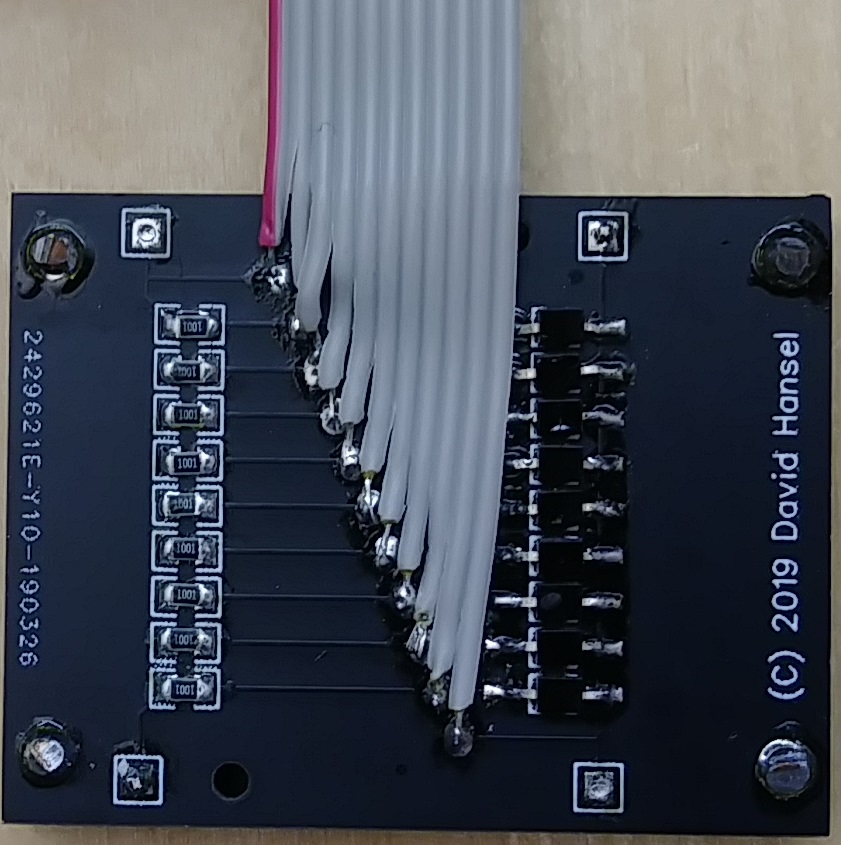
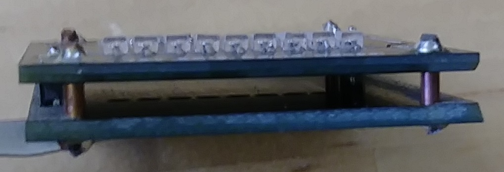
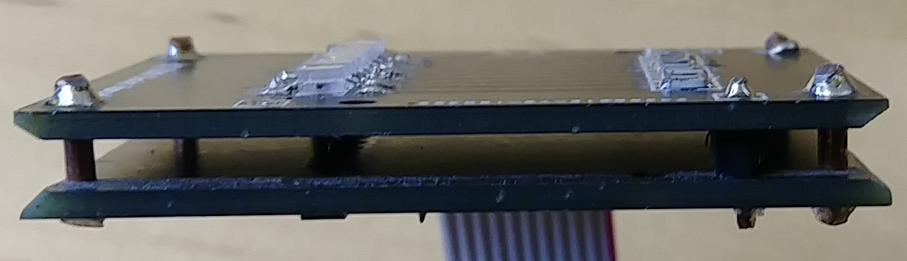
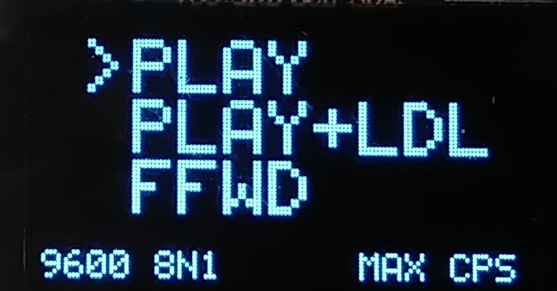
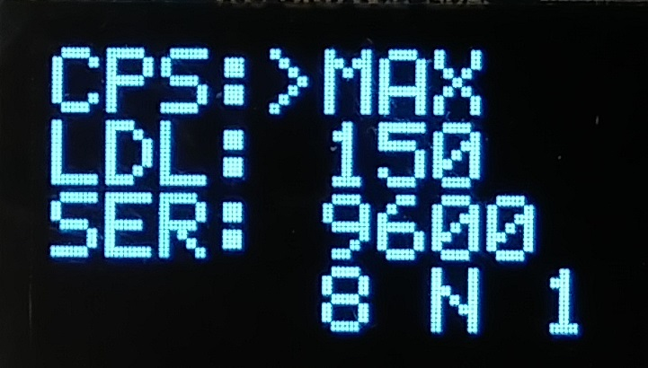
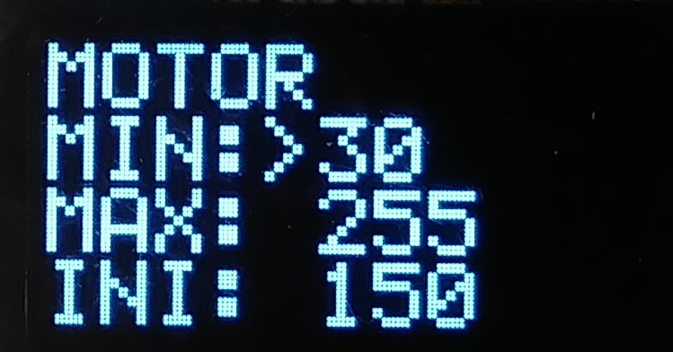
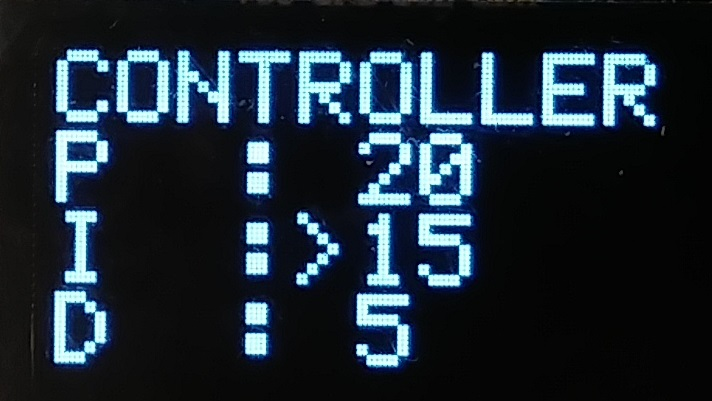
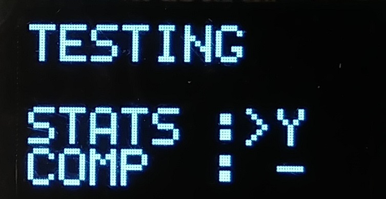

# Paper Tape Reader

This is a DIY reader for 8-bit (9-hole) vintage paper tapes. I started working on this because I
couldn't find any DIY solution online that would allow for fully automated tape playback.
Hopefully someone will find this interesting/useful!

You can watch a short demo video of the reader connected to an [Altair 8800 emulator](https://www.hackster.io/david-hansel/arduino-altair-8800-simulator-3594a6) here:

  

## Reader Head
When I started with this project, constructing the reader head was
the most uncertain aspect. I found some other DIY attempts on the web
but none seemed ideal. I wanted to use miniature photo-transistors that
could fit on a 0.1" grid (to match the .1" spacing of the paper tape holes).
I found the [Kingbright AM2520P3BT03](https://www.digikey.com/product-detail/en/kingbright/AM2520P3BT03/754-2338-1-ND/9647017)
IR phototransistors and wavelength-matched 
[ON Semiconductor QEB363ZR](https://www.digikey.com/product-detail/en/on-semiconductor/QEB363ZR/QEB363ZRCT-ND/3479521)
IR LEDs. Initial tests with these mounted on a perfboard were very promising,
so I made two matched PCBs ([emitter](schematics/readerhead-emitter-pcb.pdf) 
and [sensor](schematics/readerhead-sensor-pcb.pdf)) that can be sandwiched together
to form the reader head:

   

   

All resistors on the two boards are 0805 SMD resistors.
Resistors on the sensor board (with the photo-transistors) are 1k Ohm.
Resistors on the emitter board (with the LEDs) are 470 Ohm except for the index-hole LED which uses 330 Ohm 
(to make the LED brighter because the holes are smaller). 
Note that these resistor values were chosen for a **3.3V supply voltage**.

Gerber files for both PCBs are in the [schematics](schematics) subdirectory.

As is the signals from the reader head can be directly attached to the digital inputs of 
any 3.3V microprocessor and should give clear and stable readings. I have tested with
black and pink paper tape.

## Main Board
In addition to the reader head I also made a main board which does the following:
* Read the (parallel) data from the reader head and send it out on a serial connection
* Control a motor to automatically run the tape at proper speed given the serial transmission rate
* Provide a menu system for setting a variety of parameters

The board is centered around an Atmega328p running at 3.3V. For the menu system I used a generic
64x128 OLED display paired with a standard rotary encoder. Both are easy to find on Ebay, for the
OLED make sure that the pinout matches that on the board (many different versions exist).

There are two serial connections, one labeled "Terminal" and one labeled "Computer". This
allows the tape reader to be placed between a terminal and a computer. As long as the reader
is not actively running, all data is just passed between the "Terminal" and "Computer" serial
ports. When the reader is running, it disconnects the terminal input and sends the tape data
out to the computer instead.

## Motor Control
The reader head and main board can be used without a motor by manually pulling the tape,
however one of the main features is the ability to control the motor as seen in the video.

Motor power is varied using PWM. The PWM setting gets adjusted by a PID controller whose
parameters can be easily set using the menu system (see below).

Note that there is no direct connection built into the firmware between the serial transmission 
speed and motor speed. Instead, the PID controller varies the motor power to achieve and hold
a 10% fill state of the internal transmit buffer. Since PID parameters and basic motor parameters
are configurable via the menu system, a variety of (DC) motors should be supported.

I just used a motor that I had salvaged from an old printer and adjusted the parameters
by experimentation.

## Menu System

The menu system is operated by the rotary controller. The current item is marked by a ">"
symbol and rotating will move between items and screens. Generally, a short button push 
on an item advances it to its next setting (e.g. next greater baud rate). A long button push
puts it into "modify" mode where rotating the controller changes the setting. Exit "modify"
mode via a short button push.

The first (and main) menu screen. The three items here (PLAY, PLAY+LDL, FFWD) are not settings
but actions:
* A short push on **PLAY** will start playing the tape. Push again to stop playing. Play stops
automatically if no index hole is seen within 2 seconds after starting or 1 second while running.
* A short push on **PLAY+LDL** starts playing **with line delay**. Line delay causes the reader to
pause for a configurable amout of time (see second screen) after sending a NEWLINE character.
This can be necessary if the receiving computer needs extra time to process a newline.
* A short push on **FFWD** will start fast-forwarding the tape. It just runs the motor at full speed
until another push exists fast forward mode.
* A long push on either PLAY or PLAY+LDL is a shortcut to FFWD
* A long push on FFWD enters a test mode. In this mode the display shows the current state of all 
data holes (index hole is marked with a "^"). Rotating the controller adjusts motor power between
0 and 255. A short push exits test mode.

The bottom row shows the currently selected serial parameters and characters-per-second setting.

This screen configures transmission parameters:

* The **CPS** setting specifies a *maximum* characters-per-second setting. If this is set to less 
than what the serial baud rate allows the reader will pause between sending characters so as to
not exceed the CPS setting.
* The **LDL** setting specifies the line delay in milliseconds (see PLAY+LDL above)
* The **SER** setting specifies serial parameters. Possible baud rates range from 110-115200.
Parity can be even, odd or none and one or two stop bits are supported.

This screen configures basic motor parameters:

* Set the **MIN** setting to the minimum power required to keep the motor running. You can experiment
with this in the test mode on the first screen.
* The **MAX** setting allows to limit the maximum motor power if that is necessary
* The **INI** setting limits the *initial* motor power which can be necessary to avoid immediately
overflowing the send buffer when starting to read.

This screen configures the PID controller parameters. The firmware uses the 
[Arduino PID Controller](https://playground.arduino.cc/Code/PIDLibrary/) library.
The values specified here are the parameters to the [SetTunings()](https://playground.arduino.cc/Code/PIDLibrarySetTunings)
function **in steps of 1/100**. For example, setting P=10,I=20,D=15 is equivalent to
calling SetTunings(0.1,0.2,0.15).

This configures statistics display and **COMP** mode. 

If **STAT** is set to Y then after reading a tape and finishing to send the data, the reader
will show a statistics sreen, displaying CHR (number of characters sent), SEC (number of 
seconds used to send) and CPS (characters per second) information.

The **COMP** (compare mode) item is visible only if "#define COMPARE_PROG_SET" in the firmware is 
set to 1 or 2. If so, the compiler will integrate images of certain files (e.g. 4k BASIC, for details
see the bottom of the [PaperTapeReader.ino](firmware/PaperTapeReader/PaperTapeReader.ino) file).
You can then select one of these files here. The reader will then compare any data read on the
tape to the stored data and immediately exit and show an error if a difference is found.

##Mechanical Construction

I kept the mechanical construction pretty simple (using just 1x2s and plywood). Still using the
Lego axles and wheels for spools from my first prototype because I still haven't found a solution
that works better than that setup.

The two paper guides you can see in the picture at the top of the page are useful when running at
lower speeds where motor power regulates up and down. They introduce some drag that stops the
tape from unspooling too fast (due to momentum) when the motor regulates down. They are not needed
when only running at full speed.
